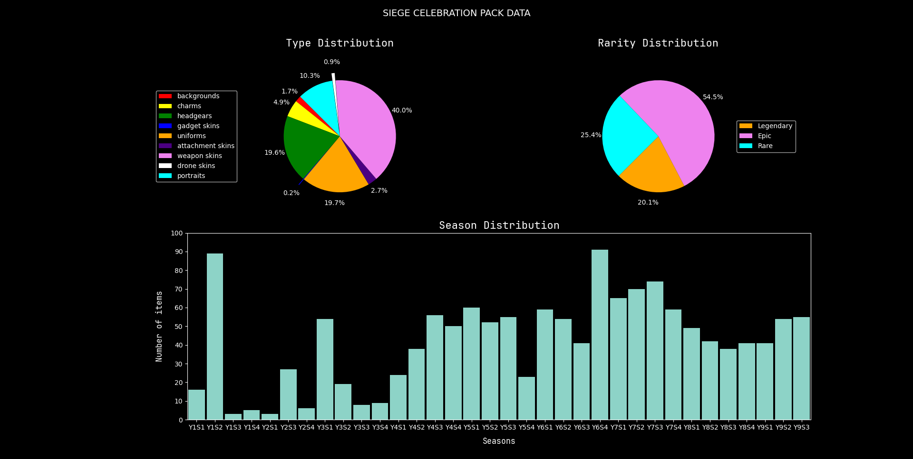

# 🛡️ Siege Celebration Pack Analyzer

A Python-based data analysis tool that breaks down the contents of Rainbow Six Siege's Celebration Packs. This project uses SQLAlchemy, Pandas, and Matplotlib to visualize item distributions by **type**, **rarity**, and **season**.

---

## 📊 Features

- 🧠 **Automated data parsing** from a local database
- 📦 Breakdown of item **types** (skins, charms, uniforms, etc.)
- ⭐ Distribution by **rarity** (Rare, Epic, Legendary)
- 📅 Visual representation of **seasonal origin** of each item
- 📈 Custom Matplotlib visualizations

---

## 🧰 Requirements

- Python 3.10+
- SQLAlchemy (ORM)
- Pandas (data manipulation)
- Matplotlib (data visualization)

